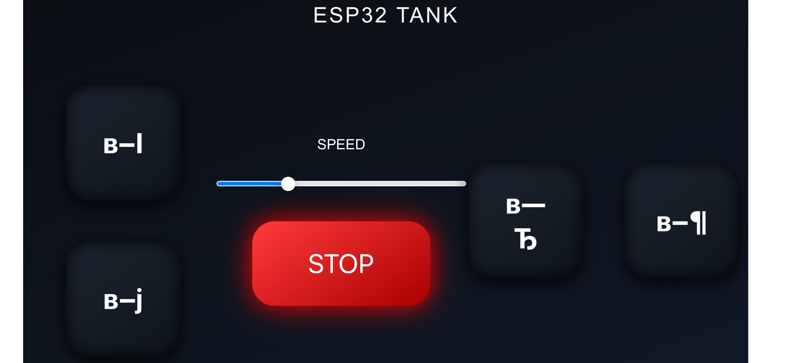

# ESP32 WiFi Tank Robot 🚗📡

A simple and responsive WiFi-controlled tank robot based on **ESP32 + L298N** motor driver.
The robot creates its own access point and is controlled from a mobile phone or PC through a modern web interface with buttons and a speed slider.

---

## 📸 Robot Photos


---

## 🌐 Web Control Interface



---

## ✨ Features

* WiFi control via ESP32 Access Point
* Real-time motor movement control
* Smooth PWM speed control
* Mobile-friendly interface
* Touch & pointer support
* Instant STOP button
* Lightweight and fast web server

---

## 🧠 Project Background

Originally, the project was planned to use the **ZK5AD motor driver**, which provides higher efficiency and more stable motor control.

However, the driver was not available for purchase or delivery at the time of development.
Because of this limitation, the project was redesigned to work with the **L298N driver**, which is more accessible and widely used in educational and hobby robotics.

Despite being an older and less efficient driver, L298N fully meets the needs of this robot and ensures stable control of both motors.

---

## 🧠 How It Works

1. ESP32 creates a WiFi network:

   * SSID: **ESP32_TANK**
   * Password: **12345678**

2. User connects from phone or laptop.

3. Open browser and go to:

   ```
   192.168.4.1
   ```

4. Web page loads with control buttons:

   * ▲ Forward
   * ▼ Backward
   * ◀️ Left
   * ▶️ Right
   * STOP
   * Speed slider

5. Buttons send HTTP requests to ESP32:

   ```
   /move?y=1&x=0
   /speed?val=170
   /stop
   ```

6. ESP32 converts commands → PWM signals → motors.

---

## 🔌 Hardware

### Components

* ESP32
* L298N Motor Driver
* 4 DC Motors (tank tracks)
* Battery pack
* Wires

### Pin Configuration

| ESP32 Pin | L298N |
| --------- | ----- |
| 25        | ENA   |
| 26        | IN1   |
| 27        | IN2   |
| 14        | ENB   |
| 12        | IN3   |
| 13        | IN4   |

PWM:

* Frequency: **1000 Hz**
* Resolution: **8 bit**

---

## ⚙️ Software Stack

* Arduino framework for ESP32
* WebServer library
* HTML + CSS + JavaScript UI
* PWM motor control via `ledcWrite()`

---

## 🚀 Installation

### 1. Install ESP32 support in Arduino IDE

Add board manager URL:

```
https://dl.espressif.com/dl/package_esp32_index.json
```

### 2. Install libraries

Already included:

* WiFi.h
* WebServer.h

### 3. Upload code

Select board:

```
ESP32 Dev Module
```

Upload sketch to ESP32.

---

## 📱 Usage

1. Power the robot
2. Connect to WiFi:

   ```
   ESP32_TANK
   ```
3. Open:

   ```
   http://192.168.4.1
   ```
4. Control movement using buttons and slider

---

## 🕹 Controls

| Action   | Command |
| -------- | ------- |
| Forward  | y=1     |
| Backward | y=-1    |
| Left     | x=-1    |
| Right    | x=1     |
| Stop     | y=0 x=0 |
| Speed    | 80–255  |

---

## 🛠 Future Improvements

* Camera streaming
* Autonomous driving mode
* Bluetooth control
* Battery monitoring
* Gyroscope stabilization
* Mobile app version

---

## 📄 Project Structure

```
/KaRKiG-project
 ├── KaRKiG-code.ino
 ├── README.md
 └── docs/
     ├── robot_photo_1.jpg
     └──  web_interface.jpg
     
```
